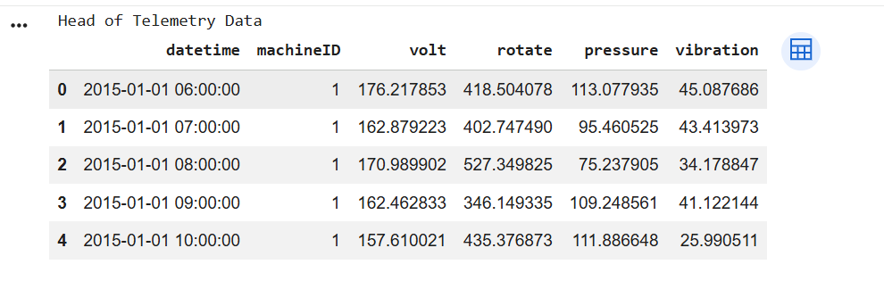
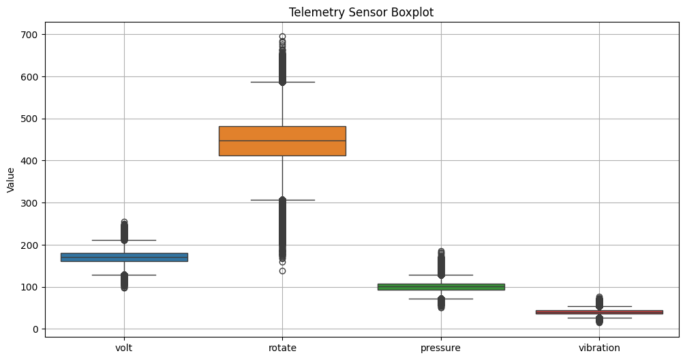
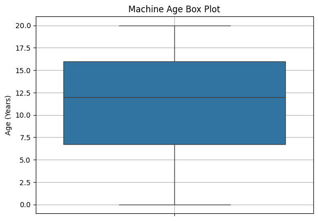
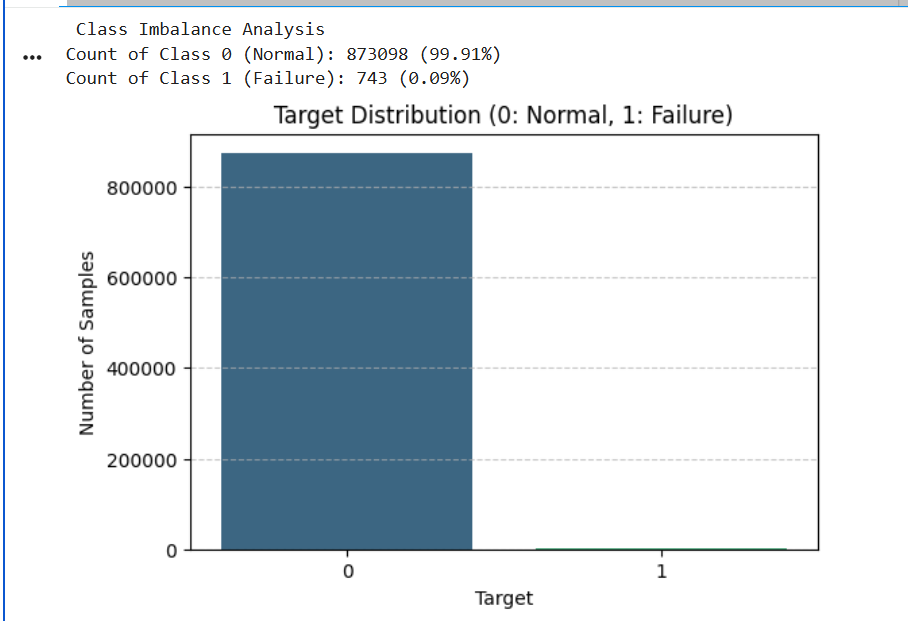
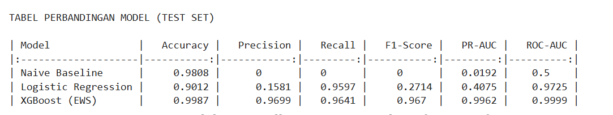
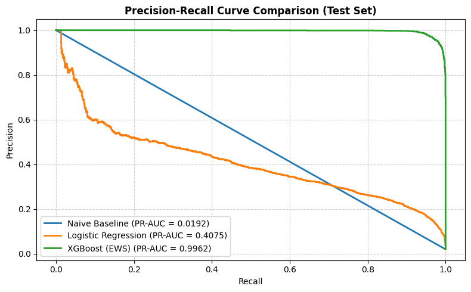
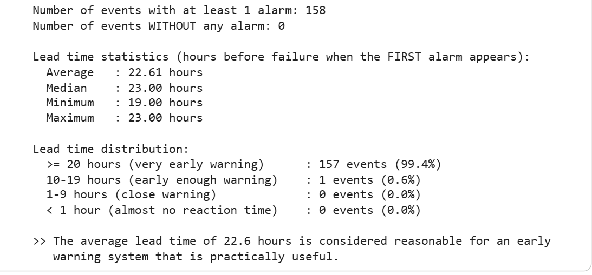
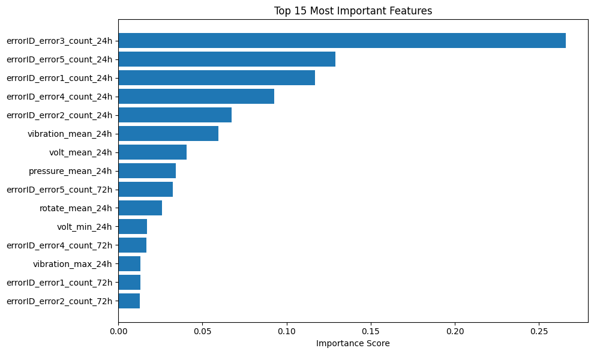

Predictive Maintenance Early Warning System

This notebook builds an Early Warning System (EWS) to predict machine failures using machine learning. The main goal is to detect failures before they happen, giving the maintenance team time to take action and reduce machine downtime.

Project Overview

This project focuses on predicting machine failures in an industrial environment. The system uses sensor data (voltage, rotation, pressure, and vibration), error logs, and maintenance records to find patterns that may indicate a possible machine failure.

Tech Stack
The primary technologies and libraries used in this notebook are:

- **Python**: The main programming language for data processing, analysis, and machine learning.
- **pandas**: For data manipulation, preprocessing, and analysis.
- **NumPy**: For numerical operations and array processing.
- **scikit-learn**: For baseline machine learning models such as DummyClassifier and LogisticRegression, time-based data splitting, preprocessing, and evaluation metrics.
- **XGBoost**: For the gradient boosting model used to develop the predictive maintenance model.
- **Matplotlib**: For creating data visualizations and analyzing trends over time.
- **Seaborn**: For statistical data visualization and exploring relationships between variables.

Data Sources

This image displays the first 5 rows of the Telemetry Dataset (telemetry_df), which records the operational health of machines at 1-hour intervals.

- **datetime**: Timestamp of the sensor measurement, logged hourly.
- **machineID**: Unique identification number for each machine (e.g., Machine 1).
- **volt**: Electrical voltage supplied to the machine.
- **rotate**: Rotational speed of the machine (RPM).
- **pressure**: Internal operating pressure.
- **vibration**: Mechanical vibration level recorded on components.

The analysis utilizes several datasets:

telemetry_df: Machine telemetry data (voltage, rotation, pressure, vibration) recorded hourly.

errors_df: Error logs recorded by machines over time.

maint_df: Maintenance records detailing component replacements.

machines_df: Machine metadata, including model type and age.

failures_df: Records of historical machine failure events.

Methodology
The notebook follows a structured end-to-end pipeline:

Data Loading & Initial Exploration: Loading all datasets and performing initial checks (missing values, duplicates, data types, descriptive statistics, outlier detection, and frequency analysis).

**Telemetry Sensor Boxplot Analysis**

This boxplot shows the distribution and range of the four telemetry features (volt, rotate, pressure, and vibration).

- **Value Ranges**:
  - `rotate`: Has the highest values, mostly around 400–500 RPM.
  - `volt`: Mostly stays around 160–180 V.
  - `pressure`: Mostly ranges from 90–110 units.
  - `vibration`: Has the lowest values, mostly around 35–45 units.
- **Outliers**:
  - All four sensors have some values outside the normal range.
  - These values may show unusual machine conditions or early signs of problems.
  - Therefore, the outliers are kept because they may be useful for predictive maintenance.

**Machine Age Distribution**

- **Range**: Machine ages range from 0 to 20 years, with a median age of 12 years.
- **IQR**: The middle 50% of machines are between 7 and 16 years old. There are no extreme outliers.
- **Takeaway**: The dataset includes a good mix of new, medium-age, and older machines, helping the model learn patterns at different stages of machine life.

**Class Imbalance Analysis**

- **Distribution**: Normal operations make up 99.91% (873,098 samples), while failures make up only 0.09% (743 samples).
- **Strategy**: Accuracy is not reliable for this dataset because failures are very rare. Therefore, class weighting (scale_pos_weight) and metrics such as PR-AUC, Recall, and F1-Score are used to better evaluate the model's ability to detect failures.

Preprocessing: Basic feature engineering to create 24-hour rolling mean and standard deviation for telemetry data, along with encoding machine models.

Baseline Models:

Naive Baseline (DummyClassifier): Established using a simple strategy (most frequent class) to set a minimum benchmark.

Logistic Regression Baseline: Trained on basic features with class weighting (class_weight='balanced') to handle class imbalance.

Advanced Feature Engineering: Comprehensive feature engineering applied to capture temporal dynamics:

Rolling 24-hour mean, standard deviation, min, and max for telemetry features.

Rate of change (diff) for telemetry features.

Rolling 24-hour and 72-hour counts for different error types.

Hours elapsed since last maintenance for each component.

Machine metadata (model and age).

Target Labeling & Time-Based Data Split: A forward-looking target variable (target) is created to predict failures within a t+1 to t+24 hour window. Data is split chronologically into Train (70%), Validation (15%), and Test (15%) sets to prevent temporal data leakage and simulate real-world deployment.

XGBoost Model Training: An XGBoost classifier trained on the full feature set, addressing class imbalance using scale_pos_weight.

Threshold Tuning: Optimal decision threshold for XGBoost is determined using the validation set to maximize F1-score.

Model Comparison: All three models (Naive, Logistic Regression, XGBoost) are evaluated on the held-out test set using Accuracy, Precision, Recall, F1-Score, PR-AUC, and ROC-AUC. A comparative summary table and Precision-Recall curves are generated.

**Model Performance Comparison**

- **Naive Baseline**: Fails to detect any failure cases, with 0% Precision and Recall. Although it achieves 98.08% accuracy, this shows that accuracy can be misleading when the data is highly imbalanced.
- **Logistic Regression**: Detects most failures with a high Recall of 95.97%, but produces many false alarms. Its Precision is only 15.81%, resulting in a low F1-Score of 0.2714.
- **XGBoost**: Gives the best overall results. It detects 96.41% of failures (Recall) while keeping false alarms low with 96.99% Precision. It also achieves an excellent PR-AUC of 0.9962, showing strong performance on the imbalanced dataset.

Data Leakage & Robustness Checks: Rigorous checks performed to ensure validity:

**Data Leakage Verification**

- **Ablation Test**: Removing all 10 `errorID_*` features reduces the PR-AUC from 0.9962 to 0.9012. The model still performs well using only sensor data, showing that it does not depend only on error logs.
- **Event-Level Detection**: The model detects 100% of failure events (158/158). This means all recorded failure events were detected, while the row-level recall is 0.9600.
- **Correlation Check**: The highest correlation with the target is 0.3366 (`errorID_error5_count_24h`), which is relatively low. This suggests there is no strong direct correlation that would indicate obvious data leakage.

Ablation Test: Assessing the explicit impact of errorID\_\* features on predictive power.

Event-Level Detection Rate: Verifying if row-level recall accurately reflects failure detection at the event level.

Correlation Analysis: Checking for collinearity or near-perfect correlations between individual features and the target.

Early Warning Analysis: Evaluating early warning utility by measuring lead time prior to actual failure events.

**Early Warning Analysis**

- **Warning Time**: The system gives its first warning an average of 22.61 hours before a failure. The median is 23 hours, with a range of 19–23 hours.
- **Early Detection Rate**: 99.4% of failure events (157 out of 158) trigger a warning at least 20 hours before failure. All 158 failure events are detected.
- **Operational Impact**: Around 23 hours of warning time gives the maintenance team enough time to inspect the machine and perform preventive maintenance before a failure occurs.

Key Findings

**Feature Importance Analysis**

- **Top Feature**: The number of errors in the last 24 hours, especially `errorID_error3_count_24h`, has the biggest impact on the model's predictions, with an importance score above 0.25.
- **Other Important Features**: Average sensor values over the last 24 hours, especially `vibration_mean_24h` and `volt_mean_24h`, also play an important role.
- **Takeaway**: Recent errors and sensor changes over the last 24 hours give stronger warning signals than using a longer 72-hour period.

Data Characteristics: High class imbalance in failure events requiring specialized loss handling (scale_pos_weight, threshold tuning).

Baseline Progression: Logistic Regression significantly outperforms the Naive baseline, proving linear signals exist in raw telemetry.

Advanced XGBoost EWS: XGBoost paired with full feature engineering demonstrates superior performance across all critical metrics (PR-AUC, F1-Score for the Failure class).

Pipeline Validity: Data leakage checks confirm model robustness, providing reliable lead times for operational early warnings.
